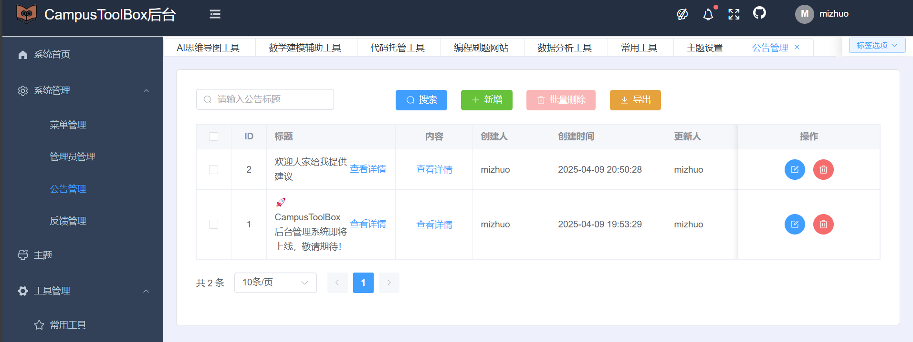

# 🎯 CampusToolBox - 校园百宝箱

## 📝 项目介绍
CampusToolBox(校园百宝箱) 是一个基于 Vue 3 + Spring Boot 的前后端分离架构的校园工具集导航平台。前端采用 Vue 3 + TypeScript + Vite + Element Plus 技术栈，实现了响应式布局和主题切换等现代化特性；后端基于 Spring Boot + MyBatis Plus + MySQL + Redis 构建，采用 JWT + Spring Security 实现身份认证和权限控制。项目分为用户前台和管理后台两个子系统，前台提供工具集展示、收藏、搜索等功能，后台实现了完整的工具管理、用户管理和数据统计功能。整个项目采用模块化设计，具有良好的可扩展性和维护性，是一个功能完整、技术全面的全栈项目。

## 📸 项目展示

### 用户前台
<table>
  <tr>
    
    
  </tr>
</table>

### 管理后台
<table>
  <tr>
    
    
  </tr>
  <tr>
    <td></td>
    <td></td>
  </tr>
</table>

## 🎨 功能特性
- 📱 响应式布局，支持多端访问
- 🔍 工具分类检索与快速搜索
- 👤 用户收藏与个性化推荐
- 🛠 后台工具管理系统
- 📊 访问数据统计分析
- 🌈 主题切换功能
- 🔐 完善的权限管理

## 🚀 技术栈
### 前端技术
- Vue 3 + TypeScript
- Vite 构建工具
- Element Plus UI 框架
- Vue Router 路由管理
- Pinia 状态管理
- Axios HTTP 客户端

### 后端技术
- Spring Boot 2.7.x
- MyBatis Plus
- MySQL 8.0
- Redis 缓存
- Spring Security
- JWT 认证

## 🌐 在线预览
- 用户前台：[https://www.campustoolbox.com](待部署)
- 管理后台：[https://admin.campustoolbox.com](待部署)

## 📥 项目下载
```bash
# 使用 Git 克隆项目
git clone https://github.com/WuXiongcai/CampusToolBox.git

# 进入项目目录
cd CampusToolBox

# 查看目录结构
ls
# 你将看到以下目录：
# - campustoolbox_admin/  (管理后台前端项目)
# - campustoolbox_user/   (用户前台前端项目)
# - springboot/ (后端服务项目)
```

## 💻 环境准备

### 前端环境要求
- Node.js 16+
- npm 或 yarn
- IDE 推荐：VS Code

### 后端环境要求
- JDK 1.8+
- Maven 3.6+
- MySQL 8.0+
- Redis 6.0+
- IDE 推荐：IntelliJ IDEA

## 🚀 快速开始

### 前台用户系统（campustoolbox_user）
```bash
# 进入项目目录
cd campustoolbox_user

# 安装依赖
npm install

# 启动开发服务器
npm run dev

# 构建生产版本
npm run build
```

### 后台管理系统（campustoolbox_admin）
```bash
# 进入项目目录
cd campustoolbox_admin

# 安装依赖
npm install

# 启动开发服务器
npm run dev

# 构建生产版本
npm run build
```

### 后端服务
```bash
# 导入数据库脚本
运行 /test_project.sql

# 修改配置
更新 application.yml 中的数据库的配置，修改成你本地的MySQL用户名和密码

# 启动服务
运行 SpringbootApplication 主类
```

## 📌 其他说明
- 项目默认管理员账号：admin
- 默认密码：123456
- 开发环境前端端口：5173（用户端）、5174（管理端）
- 后端服务端口：9090

## 👥 感谢本项目贡献者

| 姓名 | 职责 | 联系方式 |
|------|------|----------|
| 开发者1 | 前端开发 | example1@email.com |
| 开发者2 | 后端开发 | example2@email.com |
| 开发者3 | UI设计 | example3@email.com |

## 📄 许可证
本项目采用 MIT 许可证 